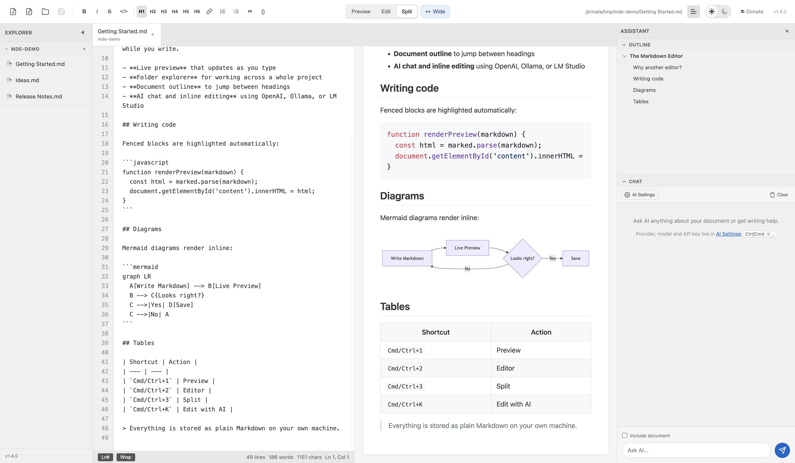
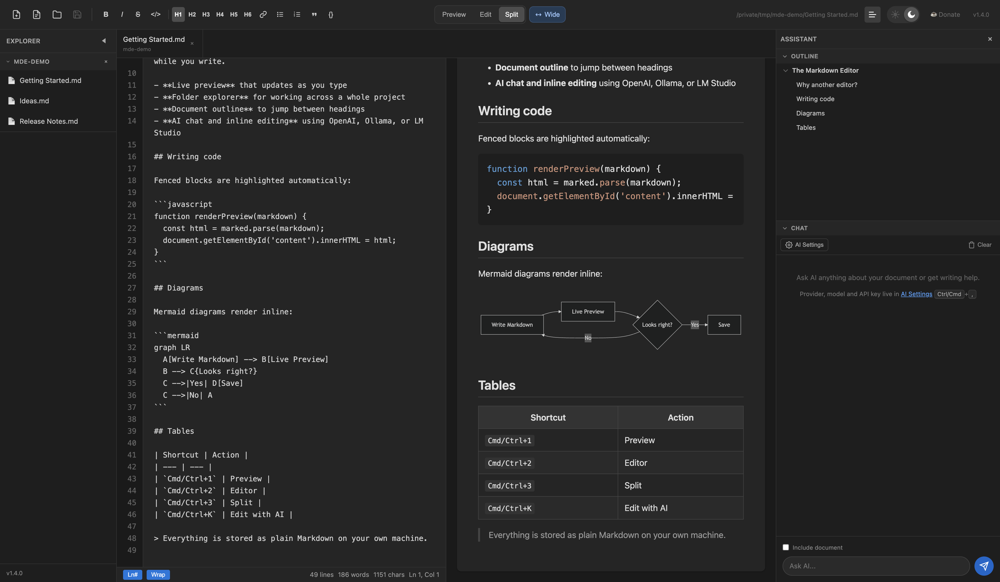
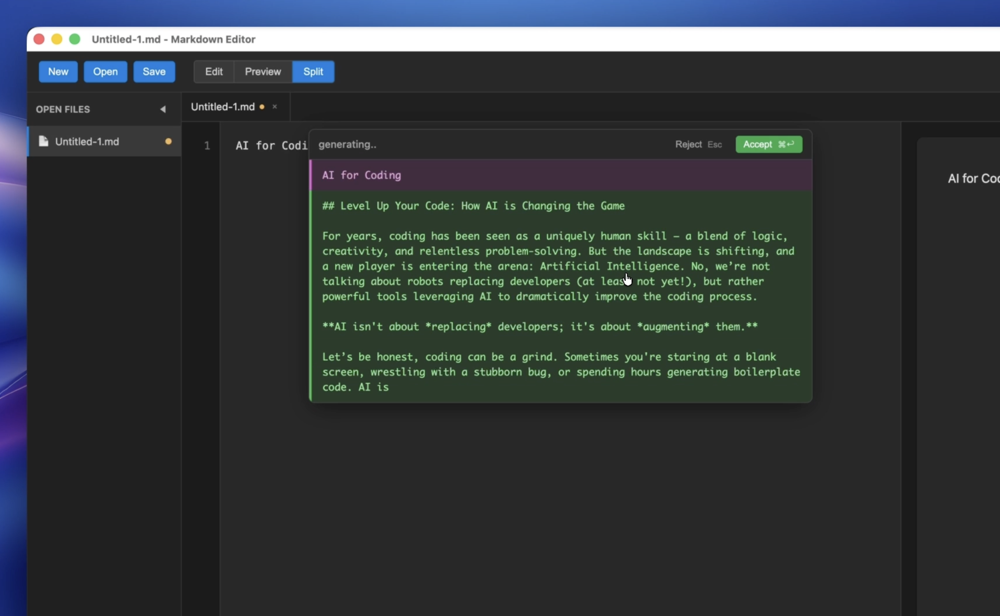
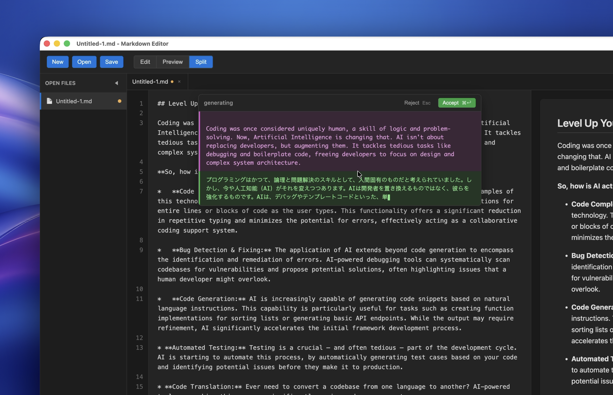

# Markdown Editor with AI

A simple and lightweight Markdown editor with AI features for Windows, Mac, and Linux

AI features work with local models via Ollama or LMStudio

If you like this project, please consider supporting it 

[](https://buymeacoffee.com/donvitocodes)

## Features

- **Live Preview** - Real-time preview of Markdown content as you type
- **Three View Modes** - Preview, Editor, or Split, switchable from the toolbar or keyboard
- **Wide Mode** - Use the full window width for long-form Markdown
- **Syntax Highlighting** - Code blocks with syntax coloring for multiple languages
- **Mermaid Diagrams** - Flowcharts and diagrams rendered inline, click to enlarge
- **Folder Explorer** - Open a folder and move between all its Markdown files
- **Multi-Tab Support** - Open and work with multiple files simultaneously
- **Document Outline** - Jump between headings in the side panel
- **Dark Mode** - Toggle between light and dark themes
- **AI Features** (see below)

### Keyboard shortcuts

| Shortcut | Action |
| --- | --- |
| `Cmd/Ctrl+N` | New file |
| `Cmd/Ctrl+O` | Open file |
| `Cmd/Ctrl+Shift+O` | Open folder |
| `Cmd/Ctrl+S` | Save |
| `Cmd/Ctrl+1` | Preview |
| `Cmd/Ctrl+2` | Editor |
| `Cmd/Ctrl+3` | Split |
| `Cmd/Ctrl+Shift+W` | Toggle wide mode |
| `Cmd/Ctrl+K` | Edit with AI |
| `Cmd/Ctrl+,` | Settings |

### Light Mode


### Dark Mode


## AI Features

The editor includes a built-in AI plugin for intelligent text editing, plus an
AI chat panel docked in the side panel alongside the document outline.

Right-click in the editor (or press `Cmd/Ctrl+K`) for AI-powered transformations:

- **Edit with AI** - Describe what you want, with or without a selection
- **Make shorter** - Condense text while keeping key information
- **Make longer** - Expand text with more detail and examples
- **More formal tone** - Rewrite in a professional tone
- **More casual tone** - Rewrite in a conversational tone
- **Fix grammar & spelling** - Correct errors automatically

The rewrite actions need selected text, and AI editing is available while the
editor is visible (Editor or Split view).

### Generate text using AI


### Translate text using AI


### Supported AI Providers

Configure any OpenAI-compatible API in Settings:
- **OpenAI** - GPT-4o, GPT-4o-mini
- **Ollama** - Local models (Llama, Mistral, etc.)
- **LM Studio** - Local models
- **Custom** - Any OpenAI-compatible endpoint

### Configure your AI provider

1. Click **AI Settings** in the Chat panel — or open **Settings** (`Cmd/Ctrl+,`)
2. Go to the **AI & Plugins** tab
3. Select your AI provider and enter your API key
4. Choose your preferred model

## Installation

```bash
npm install
```

## Usage

```bash
npm start
```

## Build

Build distributable packages:

```bash
# Windows
npm run build:win

# Mac
npm run build:mac

# All platforms
npm run build:all
```

## License

MIT
